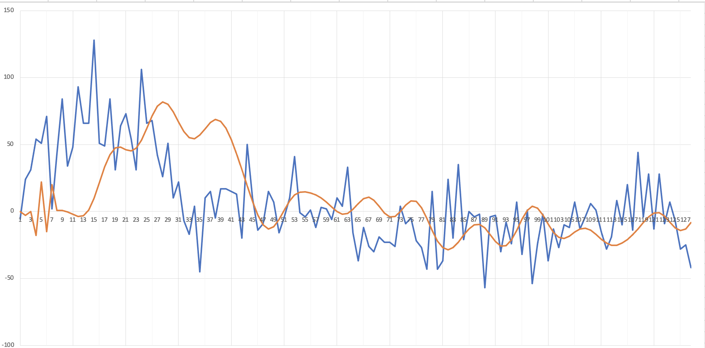

# HW7_DSP
This folder contains the following program
* A program that defines finite impulse response in language of arm.
* A program writen in MbedOS and run on STM32 which detects accelerator signal and applies FIR filter on it.

## 1. arm_fir.h
* It is from an example in CMSIS.
* It defines the coeffients of the finite impulse response and the related function.
## 2. main.cpp
* It first puts do_fir and print_fir functions on the event queue, and use the thread that reads accelerator to call them.
* The functions are called when the buffer is full
## 4. Result
* The result is shown in the following figure.

* It has normalized cutoff frequency 0.25. In our code sampling rate is 10 Hz cutoff frequency is 2.5Hz. A grid represents one second.

## 3.Reference
* NTUEE embedded system week5 slides.
